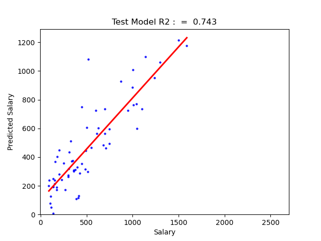

# ⚾ Salary Prediction with Machine Learning - Beyzbol Oyuncu Maaş Tahmini

Bu proje, 1986 yılına ait **beyzbol oyuncularının** kariyer istatistikleri ve maaş bilgilerini kullanarak, oyuncuların maaşlarını tahmin eden bir **Makine Öğrenmesi Modeli** geliştirmeyi amaçlamaktadır. 

---

## 📊 Projenin Amacı

- Oyuncuların kariyer istatistiklerinden yola çıkarak maaşlarını tahmin edebilecek bir **regresyon modeli** oluşturmak.
- **Eksik veri analizi, aykırı değer analizi ve özellik mühendisliği** uygulayarak model performansını artırmak.
- **Doğrusal Regresyon (Linear Regression)** modeli ile oyuncu maaşlarının tahmin performansını değerlendirmek.

---


## 📊 Kullanılan Veri Seti

- **Veri Seti:** [Hitters Dataset](https://www.stat.cmu.edu/~datasets/)
- **Kapsam:** 1986 yılı beyzbol oyuncularının istatistikleri ve maaş bilgileri.
- **Hedef Değişken:** Salary (Maaş)

### 📊 Örnek Değişkenler

| Değişken | Açıklama |
|---|---|
| AtBat | Sezon boyunca yapılan atış sayısı |
| Hits | Vuruş sayısı |
| HmRun | Home run sayısı |
| Runs | Yapılan koşu sayısı |
| RBI | Koşu getiren vuruş sayısı |
| Walks | Dışarı çıkmadan yapılan yürüyüş sayısı |
| League | Oyuncunun ligi (A/N) |
| Division | Oyuncunun oynadığı bölge (E/W) |
| Salary | Oyuncunun maaşı (hedef değişken) |

---

## 🔎 Veri Analizi Süreci

### 📌 1. Keşifçi Veri Analizi (EDA)

- Verinin genel yapısı incelendi.
- Eksik ve aykırı değer analizleri yapıldı.
- Kategorik ve sayısal değişken analizleri gerçekleştirildi.
- Korelasyon matrisleri ve **heatmap** ile değişken ilişkileri görselleştirildi.

**Örnek Görsel: Korelasyon Isı Haritası**


---

### 📌 2. Eksik ve Aykırı Değer Yönetimi

- **Eksik Değerler:**
    - KNN Imputer
    - Grup Ortalamaları ile Doldurma
    - Eksik Satırların Silinmesi

- **Aykırı Değerler:**
    - IQR yöntemi ile uç değerler sınır değerlere çekildi.

---

### 📌 3. Özellik Mühendisliği (Feature Engineering)

- **Yeni Değişkenler:** 
    - Atış başarı oranı
    - Yıllık performans ortalamaları
    - Kariyer ve sezonsal istatistiklerin oranları
- Yeni değişkenler model performansını artırmak için veriye eklendi.

---

## 🧪 Modelleme Süreci

### Kullanılan Algoritma

- **Doğrusal Regresyon (Linear Regression)**

### Model Değerlendirme

| Metrik | Eğitim Seti | Test Seti |
|---|---|---|
| RMSE | Hesaplandı | Hesaplandı |
| R² | Hesaplandı | Hesaplandı |
| Çapraz Doğrulama (10 Katlı) | Hesaplandı | - |

**Örnek Görsel: Regresyon Performans Grafiği (Test Seti)**



---

## 📈 Sonuçlar

- Doğrusal regresyon modeli temel bir performans gösterdi.
- Özellik mühendisliği ve veri temizliği ile modelin doğruluğu artırıldı.
- Alternatif modellerle (Ridge, Lasso, Random Forest) ek analizler yapılabilir.

---

## 📦 Çalıştırma Adımları

1. Gerekli kütüphaneleri yükleyin:
    ```bash
    pip install pandas numpy matplotlib seaborn scikit-learn statsmodels scipy
    ```

2. Projeyi çalıştırın:
    ```bash
    python salary_prediction.py
    ```

---

## 🔧 Kullanılan Kütüphaneler

- pandas
- numpy
- matplotlib
- seaborn
- scikit-learn
- statsmodels
- scipy

---

## 📚 Proje Adımları Özet

| Adım | Açıklama |
|---|---|
| 1 | Veri Yükleme ve İnceleme |
| 2 | Eksik ve Aykırı Değer Yönetimi |
| 3 | Keşifçi Veri Analizi (EDA) |
| 4 | Özellik Mühendisliği (Feature Engineering) |
| 5 | One-Hot Encoding |
| 6 | Modelleme ve Performans Değerlendirme |


